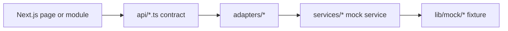
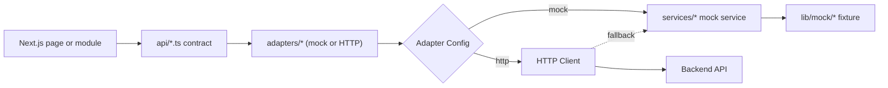

# OMEGA AI Next Phase Handoff

Last updated: 2026-06-16 (Phase 5 Complete)

## Repository Status

OMEGA AI is a stable, frontend-only Next.js App Router platform backed by mock data. The app has modular routes, reusable layout components, independently renderable feature modules, frontend API contracts, an adapter layer with HTTP client support, typed mock services, and contract models for future backend integration.

Phase 5 adds:
- Generic HTTP client abstraction (`lib/http/client.ts`)
- Adapter configuration system (`lib/adapter-config.ts`)
- Adapter factory pattern (`lib/adapter-factory.ts`)
- HTTP adapter shells for all data sources (`adapters/http/*`)
- Configuration-driven adapter selection
- Mock fallback support for HTTP failures
- Adapter interface compatibility tests
- GitLab CI/CD pipeline (`.gitlab-ci.yml`)
- Environment configuration template (`.env.example`)

No backend, database, authentication, broker API, exchange API, real AI provider, live market feed, real TradingView integration, secrets management, background worker, autonomous execution engine, or live risk engine is implemented.

## Current Architecture Summary

### Phase 4 Architecture



### Phase 5 Architecture (HTTP-Ready)



Core frontend routes:

- `/`
- `/markets`
- `/ai`
- `/knowledge`
- `/strategies`
- `/backtesting`
- `/paper`
- `/portfolio`
- `/trades`
- `/analytics`
- `/chat`
- `/news`
- `/admin`
- `/settings`

## Phase 5 Implementation Details

### HTTP Client Abstraction

**File**: `lib/http/client.ts`

Provides a generic HTTP client interface:

```typescript
export interface HttpClient {
  get<T>(url: string, config?: Partial<HttpRequestConfig>): Promise<T>;
  post<T>(url: string, body?: unknown, config?: Partial<HttpRequestConfig>): Promise<T>;
  put<T>(url: string, body?: unknown, config?: Partial<HttpRequestConfig>): Promise<T>;
  patch<T>(url: string, body?: unknown, config?: Partial<HttpRequestConfig>): Promise<T>;
  delete<T>(url: string, config?: Partial<HttpRequestConfig>): Promise<T>;
  request<T>(config: HttpRequestConfig): Promise<T>;
}
```

Features:
- Transport-independent design
- Automatic retry with exponential backoff
- Configurable timeout and retry policies
- Request/response metadata
- Error handling with retryable flag
- Uses native fetch API (browser and Node.js compatible)

### Adapter Configuration System

**File**: `lib/adapter-config.ts`

Enables switching between mock and HTTP adapters via configuration:

```typescript
export interface AdapterConfig {
  provider: "mock" | "http";
  httpBaseUrl?: string;
  httpTimeout?: number;
  httpRetries?: number;
  enableMockFallback?: boolean;
}
```

Configuration sources (in order of precedence):
1. Runtime configuration via `setAdapterConfig()`
2. Environment variables:
   - `NEXT_PUBLIC_ADAPTER_PROVIDER`
   - `NEXT_PUBLIC_ADAPTER_HTTP_BASE_URL`
   - `NEXT_PUBLIC_ADAPTER_HTTP_TIMEOUT`
   - `NEXT_PUBLIC_ADAPTER_HTTP_RETRIES`
   - `NEXT_PUBLIC_ADAPTER_ENABLE_MOCK_FALLBACK`
3. Defaults (mock provider, mock fallback enabled)

### Adapter Factory Pattern

**File**: `lib/adapter-factory.ts`

Creates adapter instances based on configuration:

```typescript
export interface AdapterFactory {
  createHttpClient(): HttpClient;
  shouldUseHttp(): boolean;
  shouldUseMockFallback(): boolean;
}
```

Benefits:
- Centralized HTTP client creation
- Configuration-driven adapter selection
- Transparent fallback logic
- Testable adapter behavior

### HTTP Adapter Shells

**Directory**: `adapters/http/`

Each HTTP adapter implements the same interface as its mock counterpart:

- `market-adapter.ts` - Market data via `/api/v1/markets/*`
- `portfolio-adapter.ts` - Portfolio data via `/api/v1/portfolio/*`
- `ai-system-adapter.ts` - AI data via `/api/v1/ai/*`
- `knowledge-adapter.ts` - Knowledge data via `/api/v1/knowledge/*`
- `strategy-adapter.ts` - Strategy data via `/api/v1/strategies`
- `news-adapter.ts` - News data via `/api/v1/news`
- `analytics-adapter.ts` - Analytics data via `/api/v1/analytics`
- `paper-trading-adapter.ts` - Paper trading data via `/api/v1/paper/*`
- `tradingview-testing-adapter.ts` - TradingView testing data via `/api/v1/tradingview/testing`
- `system-adapter.ts` - System data via `/api/v1/system/dashboard`

Each adapter:
- Checks configuration before making HTTP calls
- Falls back to mock adapter if HTTP is disabled
- Falls back to mock adapter if HTTP request fails (when enabled)
- Maintains identical interface to mock adapter
- Requires no page rewrites to switch providers

### CI/CD Pipeline

**File**: `.gitlab-ci.yml`

Automated checks on every push and merge request:

1. **Install Stage**: `npm ci` with caching
2. **Verify Stage**:
   - `npm run lint` - Code quality and style
   - `npm run test` - Unit and integration tests
3. **Build Stage**: `npm run build` - Production build verification

Pipeline fails on any check failure. Artifacts cached for performance.

### Environment Configuration

**File**: `.env.example`

Template for environment variables:

```bash
# Adapter Configuration
NEXT_PUBLIC_ADAPTER_PROVIDER=mock
NEXT_PUBLIC_ADAPTER_HTTP_BASE_URL=http://localhost:8000
NEXT_PUBLIC_ADAPTER_HTTP_TIMEOUT=30000
NEXT_PUBLIC_ADAPTER_HTTP_RETRIES=3
NEXT_PUBLIC_ADAPTER_ENABLE_MOCK_FALLBACK=true

# Feature Flags
NEXT_PUBLIC_ENABLE_MARKETS=true
NEXT_PUBLIC_ENABLE_AI=true
# ... (all 13 feature flags)
```

## Completed Phases

- **Phase 1**: Repository recovery, project analysis, and documentation baseline.
- **Phase 2**: Dashboard extraction, modular mock data, shared types, reusable cards, services, system health, and smoke tests.
- **Phase 3**: Multi-page frontend routing, independent modules, layout system, feature flags, API contracts, TradingView testing placeholders, and analytics placeholders.
- **Phase 4**: API adapter layer, backend-facing contract definitions, data source abstraction, paper trading contracts, analytics expansion, reusable result models, mock event bus, expanded tests, and handoff document.
- **Phase 5**: HTTP client abstraction, adapter configuration system, adapter factory pattern, HTTP adapter shells, configuration-driven adapter selection, mock fallback support, adapter interface compatibility tests, and GitLab CI/CD pipeline.

## Pending Phases

- **Phase 6**: Design backend skeleton and OpenAPI contract plan without wiring production runtime behavior.
- **Phase 7**: Plan persistence schemas, migrations, and audit models before implementing database writes.
- **Phase 8**: Add mock AI run history, explainability records, and evaluation fixtures before real provider integration.
- **Phase 9**: Add paper trading ledger persistence planning and deterministic fill simulation before any live trading path.

## Technical Debt

### Resolved in Phase 5
- ✅ No CI pipeline exists → Added GitLab CI/CD pipeline
- ✅ No HTTP client abstraction → Added `lib/http/client.ts`
- ✅ No adapter configuration system → Added `lib/adapter-config.ts`
- ✅ No adapter factory pattern → Added `lib/adapter-factory.ts`
- ✅ No HTTP adapter shells → Added `adapters/http/*`

### Remaining
- A local Git repository has been initialized on `main`.
- No GitHub remote is configured yet.
- GitHub CLI is not installed, so upload/push automation is blocked until an authenticated GitHub path exists.
- Mock data is static and in-memory.
- Knowledge upload UI stores selected file names only in component state.
- AI Chat is simulated and does not call a model.
- Backtesting is simulated and does not run against historical data.
- TradingView testing is simulated and does not connect to TradingView.
- Paper trading contracts exist, but there is no persistent ledger.
- Live trading remains intentionally locked.
- No backend API routes exist yet.
- No database exists yet.
- No authentication exists yet.

## Recommended Phase 6

1. **Backend Skeleton**: Create a minimal FastAPI backend with:
   - `/api/v1/health` endpoint
   - `/api/v1/status` endpoint
   - `/api/v1/modules` endpoint
   - OpenAPI schema generation
   - No database writes or live integrations

2. **OpenAPI Contract**: Define OpenAPI 3.0 schema for:
   - All market endpoints
   - All portfolio endpoints
   - All AI endpoints
   - All knowledge endpoints
   - All strategy endpoints
   - All analytics endpoints
   - All paper trading endpoints
   - All system endpoints

3. **Backend Contract Alignment**: Ensure backend responses match frontend contract expectations:
   - Response envelope format
   - Error format
   - Pagination format
   - Metadata format

4. **Integration Testing**: Add tests that:
   - Verify HTTP adapters can call backend endpoints
   - Verify response shapes match contracts
   - Verify error handling works correctly
   - Verify mock fallback activates on backend failure

5. **Documentation**: Update architecture docs with:
   - Backend folder structure
   - API route map
   - Database schema plan (without implementation)
   - Authentication plan (without implementation)

## Build Verification

Latest completed verification on 2026-06-16:

- `npm install`: passed
- `npm run lint`: passed
- `npm run test`: passed (13+ subtests)
- `npm run build`: passed
- GitLab CI pipeline: configured

## Key Design Principles Maintained

1. **Mock-First**: All adapters default to mock providers
2. **Configuration-Driven**: No code changes needed to switch providers
3. **Interface Preservation**: All adapters implement identical interfaces
4. **Backward Compatible**: Existing code works without changes
5. **Fallback Support**: HTTP failures gracefully fall back to mock
6. **Transport Independent**: HTTP client can be replaced with WebSocket, gRPC, etc.
7. **Testable**: All components have clear contracts and are independently testable
8. **Stable**: No breaking changes to existing frontend code

## Future Integration Points

### HTTP Adapters
- All HTTP adapters are disabled by default
- Enable via `NEXT_PUBLIC_ADAPTER_PROVIDER=http` and `NEXT_PUBLIC_ADAPTER_HTTP_BASE_URL`
- Mock fallback can be disabled via `NEXT_PUBLIC_ADAPTER_ENABLE_MOCK_FALLBACK=false`

### Backend Integration
- Backend can be deployed to any URL
- Frontend points to backend via `NEXT_PUBLIC_ADAPTER_HTTP_BASE_URL`
- No frontend code changes needed when switching backend URLs

### Provider Switching
- New providers can be added by creating new adapter implementations
- Configuration system can be extended to support additional providers
- Factory pattern allows dynamic provider selection

### Transport Upgrades
- HTTP client can be replaced with WebSocket client
- HTTP client can be replaced with gRPC client
- All adapters will work with new transport without changes

## Success Criteria for Phase 5

✅ HTTP client abstraction created and tested
✅ Adapter configuration system implemented
✅ Adapter factory pattern implemented
✅ HTTP adapter shells created for all data sources
✅ Configuration-driven adapter selection working
✅ Mock fallback support implemented
✅ Adapter interface compatibility tests passing
✅ GitLab CI/CD pipeline configured
✅ All existing tests continue passing
✅ No breaking changes to existing code
✅ Documentation updated
✅ Build verification passing
