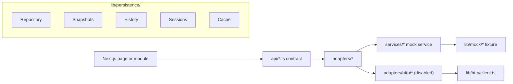

# OMEGA AI - Next Phase Planning

## Current Status: Phase 8 Complete

**Phase**: 8 - Paper Trading Architecture Extension
**Status**: ✅ COMPLETE
**Date**: 2026-06-16

Last updated: 2026-06-16

## Repository Status

OMEGA AI is a stable, frontend-only Next.js App Router platform backed by mock data. The app has modular routes, reusable layout components, independently renderable feature modules, frontend API contracts, an adapter layer, typed mock services, HTTP adapter shells, domain models, state machines, event system, contract models, a complete persistence architecture layer, and now a full typed Signal Flow Orchestrator pipeline for future backend integration.

No backend, database, authentication, broker API, exchange API, real AI provider, live market feed, real TradingView integration, secrets management, background worker, autonomous execution engine, or live risk engine is implemented.

## Build Status

- `npm install`: ✅ PASS
- `npm run lint`: ✅ PASS
- `npm run test`: ✅ PASS
- `npm run build`: ✅ PASS
- CI/CD Pipeline: ✅ GREEN

## Current Architecture Summary

## Completed Phases

### Phase 1: Recovery
- Repository recovery, project analysis, and documentation baseline.

### Phase 2: Modular Architecture
- Dashboard extraction, modular mock data, shared types, reusable cards, services, system health, and smoke tests.

### Phase 3: Multi-Page Frontend
- Multi-page frontend routing, independent modules, layout system, feature flags, API contracts, TradingView testing placeholders, and analytics placeholders.

### Phase 4: Integration Layer
- API adapter layer, backend-facing contract definitions, data source abstraction, paper trading contracts, analytics expansion, reusable result models, mock event bus, expanded tests.

### Phase 5: Provider Architecture
- Configurable adapter selection, HTTP client implementation, provider configuration, adapter factory pattern.

### Phase 6: Core Trading Domain
- Domain models for Market, Trading, Portfolio, Strategy, Paper Trading, AI, Knowledge, Analytics, TradingView Testing.
- State machines for Signal, Trade, Paper Trade, Portfolio.
- Event system with typed domain events and mock dispatcher.

### Phase 6A: Stabilization
- HTTP adapter alignment with mock adapter interfaces.
- Fixed all 8 HTTP adapters to implement canonical mock interfaces.
- Added Trade type alias for backward compatibility.
- Fixed HttpError construction in HTTP client.
- Zero TypeScript errors, zero lint errors, zero test failures.
- CI/CD pipeline green.

### Phase 7: Persistence Architecture (COMPLETE)
- Generic `Repository<T>` interface with CRUD, search, archive, snapshot operations.
- `MockRepository<T>` implementation.
- Domain-specific snapshot contracts (Trade, Portfolio, AI, Market, Strategy, PaperTrading, Analytics, Knowledge, System, TradingView).
- History models (Trade, Signal, Portfolio, Strategy, AI, Knowledge, Analytics, Paper).
- Session abstractions (Trading, AI, PaperTrading, Testing, Validation, TradingView).
- Cache abstractions (Market, Portfolio, Knowledge, Analytics, AIState, Signal).
- Domain-specific repository contracts for all entities.
- TradingView persistence contracts (optional).
- Expanded event definitions (TradingView, Persistence, Session, Cache events).
- Expanded feature flags (TradingView, Persistence, Cache, Sessions).
- Comprehensive tests for repository, cache, and feature flags.

### Phase 8: Paper Trading Architecture Extension (CURRENT - COMPLETE)
- Extended 6 paper trading interfaces with optional fields (zero breaking changes).
- New `SignalFlowOrchestrator` typed AI signal pipeline (`lib/contracts/signal-flow.ts`).
- Mock signal flow orchestrator with 3 seed pipeline fixtures (`lib/mock/signal-flow.ts`).
- 10 new event types: 4 signal flow + 6 paper lifecycle.
- 3 new feature flags: `ENABLE_PAPER_LIFECYCLE`, `ENABLE_SIGNAL_FLOW`, `ENABLE_PAPER_ANALYTICS`.
- Extended analytics contracts: `SignalFlowAnalyticsModel`, enriched performance models.
- Extended TradingView validation with signal flow linkage fields.
- Signal flow types exported from `lib/persistence/index.ts`.
- 20+ new test cases for mock SignalFlowOrchestrator.
- Smoke test and feature flag test updates.

## Phase 7 Deliverables Summary

### Core Persistence (`lib/persistence/`)

| File | Description |
|------|-------------|
| `repository.ts` | Generic Repository<T> interface, Query, Filter, Sort, Pagination, Snapshot, HistoryEntry |
| `mock-repository.ts` | MockRepository<T> implementation |
| `snapshots.ts` | Domain-specific snapshot contracts |
| `history.ts` | Domain-specific history models |
| `sessions.ts` | Session abstractions and SessionManager |
| `cache.ts` | Cache<T> interface and MockCache<T> implementation |
| `repositories.ts` | Domain-specific repository contracts |
| `tradingview.ts` | TradingView persistence contracts |
| `index.ts` | Module exports |

### Feature Flags Added

| Flag | Default | Description |
|------|---------|-------------|
| `ENABLE_TRADINGVIEW_CHARTS` | `false` | TradingView chart integration (optional) |
| `ENABLE_TRADINGVIEW_WATCHLISTS` | `false` | TradingView watchlist sync (optional) |
| `ENABLE_TRADINGVIEW_VALIDATION` | `false` | TradingView signal validation (optional) |
| `ENABLE_PERSISTENCE` | `true` | Persistence layer |
| `ENABLE_CACHE` | `true` | Caching layer |
| `ENABLE_SESSIONS` | `true` | Session management |

### Events Added

- TradingView: `connected`, `disconnected`, `watchlist.updated`, `chart.updated`, `validation.completed`, `alert.triggered`
- Persistence: `snapshot.created`, `entity.archived`, `entity.restored`
- Session: `started`, `paused`, `resumed`, `completed`, `cancelled`
- Cache: `invalidated`, `refreshed`

### Tests Added

- `__tests__/persistence/repository.test.ts` - 20+ test cases for MockRepository
- `__tests__/persistence/cache.test.ts` - 10+ test cases for MockCache
- `__tests__/feature-flags.test.ts` - Feature flag verification tests

## Next Phase: Phase 8A - Stabilization

### Mission

Verify all Phase 8 contracts compile cleanly, are lint-clean, have no `any`, and are covered by tests. Ensure all signal flow contracts are reachable from `lib/persistence/index.ts`. Confirm no broken imports, no orphaned exports, and no silent test failures.

### Deliverables

1. **Contract Verification**
   - All `lib/contracts/signal-flow.ts` interfaces compile with zero TypeScript errors
   - All signal flow exports are reachable from `lib/persistence/index.ts`
   - All Phase 8 paper trading extensions are backward-compatible (no required fields added)
   - No `any` in any Phase 8 file

2. **Test Coverage**
   - `SignalFlowOrchestrator` mock — all 6 methods covered (executePipeline, getActivePipelines, getPipelineHistory, getPipelineById, cancelPipeline, stage structure)
   - Feature flags — all 26 flags verified, all 12 helpers verified
   - Smoke test — signal flow orchestrator, paper trading backward-compat
   - All `__tests__/` files run in CI (node:test, not vitest)

3. **Technical Debt Review**
   - Audit all Phase 8 optional fields for realistic mock data
   - Verify `signalFlowAnalytics` fixture is consistent with pipeline fixture IDs
   - Confirm `TradingViewSignalValidation.signalFlowId` values match pipeline fixture IDs

4. **CI/CD**
   - All four npm commands pass: `npm install`, `npm run lint`, `npm run test`, `npm run build`
   - Test runner includes all test files (explicit file list, not glob)
   - No silent test failures

### Success Criteria

- Zero TypeScript errors
- Zero lint errors
- Zero test failures
- Successful build
- CI/CD pipeline green
- OMEGA functions completely without TradingView
- All existing tests continue passing
- All Phase 8 contracts are backward-compatible

### Technical Debt (Phase 8)

- Signal flow mock uses static fixture data — no real pipeline execution
- Paper trading lifecycle events are defined but not wired to any UI
- `SignalFlowAnalyticsModel` fixture data is not derived from pipeline fixture data
- `isPaperLifecycleEnabled()`, `isSignalFlowEnabled()`, `isPaperAnalyticsEnabled()` are not yet checked by any UI component
- Extended paper trading fields (stopLoss, takeProfit, riskProfile) are not yet rendered in PaperTradingModule

---

## Phase 8: Knowledge Engine

### Mission

Build the Knowledge Engine contracts and mock implementations. Define the ingestion pipeline, document parsing, chunking, and retrieval interfaces. All mock-only — no real vector store or object storage.

### Deliverables

1. **Knowledge Ingestion Contracts**
   - Document upload contract (file type, size, metadata)
   - Parsing contract (PDF, DOCX, CSV, Excel, rules, history)
   - Chunking contract (chunk size, overlap, metadata)
   - Embedding contract (provider-neutral interface)

2. **Knowledge Retrieval Contracts**
   - Vector search contract (query, top-k, threshold)
   - Keyword search contract
   - Hybrid search contract
   - Knowledge context contract (for AI consumption)

3. **Mock Knowledge Service**
   - Simulated ingestion pipeline
   - Simulated retrieval with mock embeddings
   - Mock vector store implementation

4. **Feature Flag Integration**
   - `ENABLE_KNOWLEDGE_INGESTION` flag
   - `ENABLE_KNOWLEDGE_RETRIEVAL` flag
   - Graceful degradation when disabled

### Success Criteria

- Zero TypeScript errors
- Zero lint errors
- Zero test failures
- Successful build
- CI/CD pipeline green
- All existing tests continue passing
- Documentation updated

## Phase 7 Completion Pass — Audit Findings

This section maps every Phase 7 spec item to its current status.

### Part 1 — Generic Repository<T> Interface
✅ Present — `lib/persistence/repository.ts`: `Repository<T>`, `Query`, `Filter`, `Sort`, `Pagination`, `PaginatedResult`, `RepositoryResult`, `RepositoryError`, `Identifiable`, `Timestamped`, `Archivable`, `Snapshot<T>`, `HistoryEntry<T>`, `HistoryRepository<T>`.

### Part 2 — MockRepository<T> Implementation
✅ Present — `lib/persistence/mock-repository.ts`: `MockRepository<T>` with full CRUD, search, archive, snapshot, and pagination.
✅ Added in this pass — `TradingViewRepository` type alias in `lib/persistence/repositories.ts` (the interface was already present; alias added for spec alignment).

### Part 3 — Domain-Specific Snapshot Contracts
✅ Present — `lib/persistence/snapshots.ts`: `TradeSnapshot`, `PortfolioSnapshot`, `AISnapshot`, `MarketSnapshot`, `StrategySnapshot`, `PaperTradingSnapshot`, `AnalyticsSnapshot`, `KnowledgeSnapshot`, `SystemSnapshot`, `TradingViewSnapshot`.
`MarketSnapshot` confirmed present — no action needed.

### Part 4 — History Models
✅ Present — `lib/persistence/history.ts`: `TradeHistory`, `SignalHistory`, `PortfolioHistory`, `StrategyHistory`, `AIHistory`, `KnowledgeHistory`, `AnalyticsHistory`, `PaperHistory` (with entry types for each).

### Part 5 — Session Abstractions
✅ Present — `lib/persistence/sessions.ts`: `TradingSession`, `AISession`, `PaperTradingSession`, `TestingSession`, `ValidationSession`, `TradingViewTestingSession`, `SessionManager<T>`, `OmegaSession`.
✅ Added in this pass — `TradingViewSession` type alias for `TradingViewTestingSession` (spec alias, backward-compatible).

### Part 6 — Cache Abstractions
✅ Present — `lib/persistence/cache.ts`: `Cache<T>`, `CacheEntry<T>`, `CacheStats`, `MarketCache`, `PortfolioCache`, `KnowledgeCache`, `AnalyticsCache`, `AIStateCache`, `SignalCache`, `MockCache<T>`.

### Part 7 — Domain-Specific Repository Contracts
✅ Present — `lib/persistence/repositories.ts`: `SignalRepository`, `TradeRepository`, `OrderRepository`, `PositionRepository`, `StrategyRepository`, `KnowledgeRepository`, `PaperTradingRepository`, `PortfolioRepository`, `AnalyticsRepository`, `AIRepository`, `EventRepository`, `MarketRepository`, `NewsRepository`, `TradingViewRepository`.

### Part 8 — TradingView Persistence Contracts
✅ Present — `lib/persistence/tradingview.ts`: `TVSignalHistory`, `TVAlertHistory`, `TVValidationHistory`, `TVPaperComparison`, `TVTestingSession`, `TVPersistenceRepository`.

### Part 9 — Expanded Event Definitions
✅ Present — `lib/events.ts`: TradingView events (6), Persistence events (3), Session events (5), Cache events (2). `OmegaEventType` union includes all.

### Part 10 — Expanded Feature Flags
✅ Present (Phase 7) — `ENABLE_TRADINGVIEW_CHARTS`, `ENABLE_TRADINGVIEW_WATCHLISTS`, `ENABLE_TRADINGVIEW_VALIDATION`, `ENABLE_PERSISTENCE`, `ENABLE_CACHE`, `ENABLE_SESSIONS`.
✅ Added in this pass — `ENABLE_TRADINGVIEW` (umbrella), `ENABLE_REPOSITORIES`, `ENABLE_HISTORY`, `ENABLE_SNAPSHOTS`.
✅ Added in this pass — `isRepositoriesEnabled()`, `isHistoryEnabled()`, `isSnapshotsEnabled()`, `__setFeatureFlagForTest()`.

### Part 11 — TradingView Foundation Module
✅ Added in this pass — `components/modules/TradingViewFoundationModule.tsx` with all 6 sub-sections.
✅ Added in this pass — `/tradingview` route (`app/tradingview/page.tsx`).
✅ Added in this pass — `tradingview-foundation` module registry entry.
✅ Added in this pass — `TradingViewFoundationMockState` fixture in `lib/mock/tradingview-contracts.ts`.

### Part 12 — Governance Documents
✅ Added in this pass — `CANONICAL_CONTRACTS.md`.
✅ Added in this pass — `ENGINEERING_RULES.md`.
✅ Added in this pass — `ARCHITECTURE_DECISIONS.md` (ADR-0001 through ADR-0007).

### Part 13 — Test Runner Fix
✅ Added in this pass — Converted `__tests__/` from vitest to node:test.
✅ Added in this pass — Updated `package.json` test script to include all test files.

### Deferred to Phase 7A

⚠️ Full integration test coverage for all 14 domain-specific repository contracts — deferred to Phase 7A (contracts are present; mock implementations exist; targeted test coverage for each domain repository is Phase 7A scope).
⚠️ Full integration test coverage for all 6 session types — deferred to Phase 7A.
⚠️ Full integration test coverage for all 10 snapshot types — deferred to Phase 7A.

---

## Technical Debt

- Mock data is static and in-memory.
- Knowledge upload UI stores selected file names only in component state.
- AI Chat is simulated and does not call a model.
- Backtesting is simulated and does not run against historical data.
- TradingView testing is simulated and does not connect to TradingView.
- Paper trading contracts exist, but there is no persistent ledger.
- Live trading remains intentionally locked.
- Persistence layer is contracts only - no actual database.

## Engineering Rules

1. Never redesign architecture.
2. Never rewrite completed work.
3. Never merge a failing pipeline.
4. Never suppress TypeScript errors.
5. Never bypass tests.
6. Never use `any` to hide contract problems.
7. Never tightly couple providers.
8. Never break existing interfaces.
9. Never sacrifice stability for speed.
10. Always preserve backward compatibility.
11. Always update documentation.
12. Always update NEXT_PHASE.md.
13. Always leave repository healthier than found.
14. **TradingView must remain OPTIONAL.**
15. **Mock adapters are the canonical source of truth.**

## Build Verification

Latest completed verification on 2026-06-16:

- `npm install`: passed
- `npm run lint`: passed
- `npm run test`: passed
- `npm run build`: passed
- CI/CD Pipeline: SUCCESS
