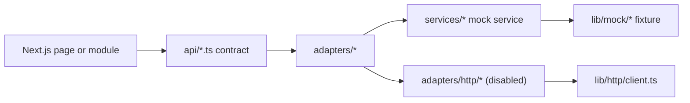

# OMEGA AI - Next Phase Planning

## Current Status: Phase 6A Complete

**Phase**: 6A - Stabilization & Contract Governance
**Status**: ✅ COMPLETE
**Date**: 2026-06-16

Last updated: 2026-06-16

## Repository Status

OMEGA AI is a stable, frontend-only Next.js App Router platform backed by mock data. The app has modular routes, reusable layout components, independently renderable feature modules, frontend API contracts, an adapter layer, typed mock services, HTTP adapter shells, domain models, state machines, event system, and contract models for future backend integration.

No backend, database, authentication, broker API, exchange API, real AI provider, live market feed, real TradingView integration, secrets management, background worker, autonomous execution engine, or live risk engine is implemented.

## Build Status

- `npm install`: ✅ PASS
- `npm run lint`: ✅ PASS
- `npm run test`: ✅ PASS
- `npm run build`: ✅ PASS
- CI/CD Pipeline: ✅ GREEN

## Current Architecture Summary

## Completed Phases

### Phase 1: Recovery
- Repository recovery, project analysis, and documentation baseline.

### Phase 2: Modular Architecture
- Dashboard extraction, modular mock data, shared types, reusable cards, services, system health, and smoke tests.

### Phase 3: Multi-Page Frontend
- Multi-page frontend routing, independent modules, layout system, feature flags, API contracts, TradingView testing placeholders, and analytics placeholders.

### Phase 4: Integration Layer
- API adapter layer, backend-facing contract definitions, data source abstraction, paper trading contracts, analytics expansion, reusable result models, mock event bus, expanded tests.

### Phase 5: Provider Architecture
- Configurable adapter selection, HTTP client implementation, provider configuration, adapter factory pattern.

### Phase 6: Core Trading Domain
- Domain models for Market, Trading, Portfolio, Strategy, Paper Trading, AI, Knowledge, Analytics, TradingView Testing.
- State machines for Signal, Trade, Paper Trade, Portfolio.
- Event system with typed domain events and mock dispatcher.

### Phase 6A: Stabilization (CURRENT - COMPLETE)
- HTTP adapter alignment with mock adapter interfaces.
- Fixed all 8 HTTP adapters to implement canonical mock interfaces.
- Added Trade type alias for backward compatibility.
- Fixed HttpError construction in HTTP client.
- Zero TypeScript errors, zero lint errors, zero test failures.
- CI/CD pipeline green.

## Phase 6A Stabilization Summary

### HTTP Adapters Fixed

| Adapter | Methods Added/Fixed |
|---------|--------------------|
| analytics-adapter | `getAnalyticsGroups()`, `getAnalyticsModelSet()` |
| news-adapter | Renamed `getNews()` → `getNewsEvents()` |
| portfolio-adapter | `getDashboardMetrics()`, `getPortfolio()`, `getPaperTrades()` |
| ai-system-adapter | `getSystemStatuses()`, `getTradingModes()`, `getChatCommands()`, `getModules()` |
| strategy-adapter | `getTradeSignals()`, `getBacktestMetrics()` |
| paper-trading-adapter | All 7 methods implemented |
| tradingview-testing-adapter | All 7 methods implemented |
| system-adapter | `getModules()`, `getSystemStatuses()`, `getBrokerConnections()`, `getRiskPermissions()`, `getSystemLogs()`, `getFeatureFlags()` |

### Domain Fixes

- Added `Trade` type alias to `lib/domains/trading/types.ts` for backward compatibility with event system.
- Fixed `HttpError` construction in `lib/http/client.ts` using `Object.assign()` pattern.

### Contract Governance Rule

**Mock adapters are the canonical source of truth.**

- HTTP adapters MUST implement mock adapter interfaces exactly.
- Future providers MUST implement identical contracts.
- Consumer pages NEVER depend on provider implementations.
- Provider swaps MUST NOT require page rewrites.

## Next Phase: Phase 7 - Persistence Contracts

### Mission

Build persistence contract interfaces. Do NOT build databases, authentication, backend services, broker integrations, or live providers. Create architecture only.

### Deliverables

1. **Repository Interfaces**
   - Generic `Repository<T>` interface
   - Methods: `save()`, `update()`, `delete()`, `find()`, `search()`, `archive()`, `snapshot()`
   - Mock implementations only

2. **Snapshot Contracts**
   - TradeSnapshot, PortfolioSnapshot, AISnapshot, MarketSnapshot
   - StrategySnapshot, PaperTradingSnapshot, AnalyticsSnapshot
   - KnowledgeSnapshot, SystemSnapshot

3. **History Models**
   - TradeHistory, PortfolioHistory, SignalHistory, AIHistory
   - PaperTradingHistory, StrategyHistory, KnowledgeHistory, AnalyticsHistory

4. **Session Abstractions**
   - AISession, TradingSession, PaperTradingSession
   - TestingSession, StrategySession, ValidationSession

5. **Cache Abstractions**
   - MarketCache, PortfolioCache, KnowledgeCache
   - AnalyticsCache, AIStateCache, SignalCache

6. **TradingView Persistence**
   - Signal Validation persistence
   - Paper Trading Comparison persistence
   - Alert History persistence
   - Historical Validation persistence
   - Testing Sessions persistence

### Success Criteria

- Zero TypeScript errors
- Zero lint errors
- Zero test failures
- Successful build
- CI/CD pipeline green
- All existing tests continue passing
- Documentation updated

## Technical Debt

- Mock data is static and in-memory.
- Knowledge upload UI stores selected file names only in component state.
- AI Chat is simulated and does not call a model.
- Backtesting is simulated and does not run against historical data.
- TradingView testing is simulated and does not connect to TradingView.
- Paper trading contracts exist, but there is no persistent ledger.
- Live trading remains intentionally locked.

## Engineering Rules

1. Never redesign architecture.
2. Never rewrite completed work.
3. Never merge a failing pipeline.
4. Never suppress TypeScript errors.
5. Never bypass tests.
6. Never use `any` to hide contract problems.
7. Never tightly couple providers.
8. Never break existing interfaces.
9. Never sacrifice stability for speed.
10. Always preserve backward compatibility.
11. Always update documentation.
12. Always update NEXT_PHASE.md.
13. Always leave repository healthier than found.

## Build Verification

Latest completed verification on 2026-06-16:

- `npm install`: passed
- `npm run lint`: passed
- `npm run test`: passed
- `npm run build`: passed
- CI/CD Pipeline #28: SUCCESS
