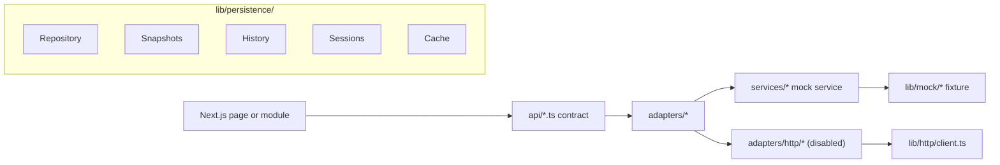

# OMEGA AI - Next Phase Planning

## Current Status: Phase 13 Complete

**Phase**: 13 - Governance Foundation + Decision Intelligence
**Status**: ✅ COMPLETE
**Date**: 2026-06-16

Last updated: 2026-06-16

## Repository Status

OMEGA AI is a stable, frontend-only Next.js App Router platform backed by mock data. The app has modular routes, reusable layout components, independently renderable feature modules, frontend API contracts, an adapter layer, typed mock services, HTTP adapter shells, domain models, state machines, event system, contract models, and now a complete persistence architecture layer for future backend integration.

No backend, database, authentication, broker API, exchange API, real AI provider, live market feed, real TradingView integration, secrets management, background worker, autonomous execution engine, or live risk engine is implemented.

## Build Status

- `npm install`: ✅ PASS
- `npm run lint`: ✅ PASS
- `npm run test`: ✅ PASS
- `npm run build`: ✅ PASS
- CI/CD Pipeline: ✅ GREEN

## Current Architecture Summary

## Core Governance

OMEGA operates through a single decision authority. SignalFlow is the sole orchestration and decision system. All other systems contribute observations, context, analytics, knowledge, experience, or explanations.

## Recommended Next Phase

Phase 14 should focus on Context Optimization. It should improve how context is organized, weighted, and delivered to SignalFlow. It must not create a decision engine, execution path, external AI provider dependency, model training system, broker integration, or parallel pipeline.

## Completed Phases

### Phase 1: Recovery
- Repository recovery, project analysis, and documentation baseline.

### Phase 2: Modular Architecture
- Dashboard extraction, modular mock data, shared types, reusable cards, services, system health, and smoke tests.

### Phase 3: Multi-Page Frontend
- Multi-page frontend routing, independent modules, layout system, feature flags, API contracts, TradingView testing placeholders, and analytics placeholders.

### Phase 4: Integration Layer
- API adapter layer, backend-facing contract definitions, data source abstraction, paper trading contracts, analytics expansion, reusable result models, mock event bus, expanded tests.

### Phase 5: Provider Architecture
- Configurable adapter selection, HTTP client implementation, provider configuration, adapter factory pattern.

### Phase 6: Core Trading Domain
- Domain models for Market, Trading, Portfolio, Strategy, Paper Trading, AI, Knowledge, Analytics, TradingView Testing.
- State machines for Signal, Trade, Paper Trade, Portfolio.
- Event system with typed domain events and mock dispatcher.

### Phase 6A: Stabilization
- HTTP adapter alignment with mock adapter interfaces.
- Fixed all 8 HTTP adapters to implement canonical mock interfaces.
- Added Trade type alias for backward compatibility.
- Fixed HttpError construction in HTTP client.
- Zero TypeScript errors, zero lint errors, zero test failures.
- CI/CD pipeline green.

### Phase 7: Persistence Architecture (CURRENT - COMPLETE)
- Generic `Repository<T>` interface with CRUD, search, archive, snapshot operations.
- `MockRepository<T>` implementation.
- Domain-specific snapshot contracts (Trade, Portfolio, AI, Market, Strategy, PaperTrading, Analytics, Knowledge, System, TradingView).
- History models (Trade, Signal, Portfolio, Strategy, AI, Knowledge, Analytics, Paper).
- Session abstractions (Trading, AI, PaperTrading, Testing, Validation, TradingView).
- Cache abstractions (Market, Portfolio, Knowledge, Analytics, AIState, Signal).
- Domain-specific repository contracts for all entities.
- TradingView persistence contracts (optional).
- Expanded event definitions (TradingView, Persistence, Session, Cache events).
- Expanded feature flags (TradingView, Persistence, Cache, Sessions).
- Comprehensive tests for repository, cache, and feature flags.

## Phase 7 Deliverables Summary

### Core Persistence (`lib/persistence/`)

| File | Description |
|------|-------------|
| `repository.ts` | Generic Repository<T> interface, Query, Filter, Sort, Pagination, Snapshot, HistoryEntry |
| `mock-repository.ts` | MockRepository<T> implementation |
| `snapshots.ts` | Domain-specific snapshot contracts |
| `history.ts` | Domain-specific history models |
| `sessions.ts` | Session abstractions and SessionManager |
| `cache.ts` | Cache<T> interface and MockCache<T> implementation |
| `repositories.ts` | Domain-specific repository contracts |
| `tradingview.ts` | TradingView persistence contracts |
| `index.ts` | Module exports |

### Feature Flags Added

| Flag | Default | Description |
|------|---------|-------------|
| `ENABLE_TRADINGVIEW_CHARTS` | `false` | TradingView chart integration (optional) |
| `ENABLE_TRADINGVIEW_WATCHLISTS` | `false` | TradingView watchlist sync (optional) |
| `ENABLE_TRADINGVIEW_VALIDATION` | `false` | TradingView signal validation (optional) |
| `ENABLE_PERSISTENCE` | `true` | Persistence layer |
| `ENABLE_CACHE` | `true` | Caching layer |
| `ENABLE_SESSIONS` | `true` | Session management |

### Events Added

- TradingView: `connected`, `disconnected`, `watchlist.updated`, `chart.updated`, `validation.completed`, `alert.triggered`
- Persistence: `snapshot.created`, `entity.archived`, `entity.restored`
- Session: `started`, `paused`, `resumed`, `completed`, `cancelled`
- Cache: `invalidated`, `refreshed`

### Tests Added

- `__tests__/persistence/repository.test.ts` - 20+ test cases for MockRepository
- `__tests__/persistence/cache.test.ts` - 10+ test cases for MockCache
- `__tests__/feature-flags.test.ts` - Feature flag verification tests

## Next Phase: Phase 8 - TradingView Testing Layer

### Mission

Build the TradingView testing layer UI components and integration. TradingView remains OPTIONAL - OMEGA must function completely without it.

### Deliverables

1. **TradingView Module Components**
   - Embedded Chart Placeholder component
   - Symbol/Timeframe Synchronization UI
   - Watchlist Management UI
   - Chart Status Display
   - Connection Status Display
   - Testing Status Dashboard

2. **TradingView Testing Page**
   - Signal comparison view
   - Alert monitoring view
   - Validation results view
   - Paper trading comparison view
   - Session management view

3. **Feature Flag Integration**
   - Conditional rendering based on TradingView flags
   - Graceful degradation when TradingView disabled
   - Clear messaging when features unavailable

4. **Mock TradingView Service**
   - Simulated chart data
   - Simulated watchlist sync
   - Simulated signal validation
   - Simulated alert triggers

### Success Criteria

- Zero TypeScript errors
- Zero lint errors
- Zero test failures
- Successful build
- CI/CD pipeline green
- OMEGA functions completely without TradingView
- All existing tests continue passing
- Documentation updated

## Technical Debt

- Mock data is static and in-memory.
- Knowledge upload UI stores selected file names only in component state.
- AI Chat is simulated and does not call a model.
- Backtesting is simulated and does not run against historical data.
- TradingView testing is simulated and does not connect to TradingView.
- Paper trading contracts exist, but there is no persistent ledger.
- Live trading remains intentionally locked.
- Persistence layer is contracts only - no actual database.

## Engineering Rules

1. Never redesign architecture.
2. Never rewrite completed work.
3. Never merge a failing pipeline.
4. Never suppress TypeScript errors.
5. Never bypass tests.
6. Never use `any` to hide contract problems.
7. Never tightly couple providers.
8. Never break existing interfaces.
9. Never sacrifice stability for speed.
10. Always preserve backward compatibility.
11. Always update documentation.
12. Always update NEXT_PHASE.md.
13. Always leave repository healthier than found.
14. **TradingView must remain OPTIONAL.**
15. **Mock adapters are the canonical source of truth.**

## Build Verification

Latest completed verification on 2026-06-16:

- `npm install`: passed
- `npm run lint`: passed
- `npm run test`: passed
- `npm run build`: passed
- CI/CD Pipeline: SUCCESS
