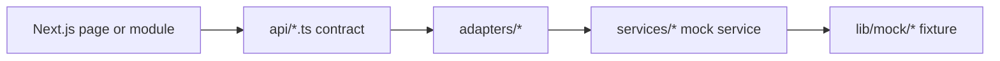

# OMEGA AI Next Phase Handoff

Last updated: 2026-06-16

## Repository Status

OMEGA AI is a stable, frontend-only Next.js App Router platform backed by mock data. The app has modular routes, reusable layout components, independently renderable feature modules, frontend API contracts, an adapter layer, typed mock services, and contract models for future backend integration.

No backend, database, authentication, broker API, exchange API, real AI provider, live market feed, real TradingView integration, secrets management, background worker, autonomous execution engine, or live risk engine is implemented.

## Current Architecture Summary

Core frontend routes:

- `/`
- `/markets`
- `/ai`
- `/knowledge`
- `/strategies`
- `/backtesting`
- `/paper`
- `/portfolio`
- `/trades`
- `/analytics`
- `/chat`
- `/news`
- `/admin`
- `/settings`

Phase 4 integration primitives:

- `adapters/` hides mock service implementation details from API contracts.
- `lib/contracts/backend.ts` defines future request, response, error, pagination, filtering, sorting, and versioning contracts.
- `lib/contracts/paper-trading.ts` defines mock paper trading account, order, position, portfolio, journal, and performance contracts.
- `lib/contracts/tradingview-testing.ts` defines testing-only TradingView chart, signal, paper comparison, alert, and historical validation contracts.
- `lib/contracts/analytics.ts` defines reusable analytics models.
- `lib/data-sources.ts` defines mock, local, REST, WebSocket, broker, exchange, and TradingView source descriptors.
- `lib/result.ts` defines loading, success, error, offline, and unavailable result states.
- `lib/events.ts` defines mock system events and a local dispatcher.

## Completed Phases

- Phase 1: Repository recovery, project analysis, and documentation baseline.
- Phase 2: Dashboard extraction, modular mock data, shared types, reusable cards, services, system health, and smoke tests.
- Phase 3: Multi-page frontend routing, independent modules, layout system, feature flags, API contracts, TradingView testing placeholders, and analytics placeholders.
- Phase 4: API adapter layer, backend-facing contract definitions, data source abstraction, paper trading contracts, analytics expansion, reusable result models, mock event bus, expanded tests, and this handoff document.

## Pending Phases

- Phase 5: Add configurable adapter selection and frontend HTTP client shells that conform to existing contracts while remaining mock-first.
- Phase 6: Design backend skeleton and OpenAPI contract plan without wiring production runtime behavior.
- Phase 7: Plan persistence schemas, migrations, and audit models before implementing database writes.
- Phase 8: Add mock AI run history, explainability records, and evaluation fixtures before real provider integration.
- Phase 9: Add paper trading ledger persistence planning and deterministic fill simulation before any live trading path.

## Technical Debt

- A local Git repository has been initialized on `main`.
- No GitHub remote is configured yet.
- GitHub CLI is not installed, so upload/push automation is blocked until an authenticated GitHub path exists.
- No CI pipeline exists.
- Mock data is static and in-memory.
- Knowledge upload UI stores selected file names only in component state.
- AI Chat is simulated and does not call a model.
- Backtesting is simulated and does not run against historical data.
- TradingView testing is simulated and does not connect to TradingView.
- Paper trading contracts exist, but there is no persistent ledger.
- Live trading remains intentionally locked.

## Recommended Phase 5

1. Configure a GitHub remote and authenticated upload path for the initialized local repository.
2. Add a configuration-driven adapter selector for mock versus future HTTP data sources.
3. Create frontend HTTP client shells that implement the same adapter interfaces but remain disabled by default.
4. Add contract tests proving mock adapters and future HTTP adapters can share the same API shape.
5. Add CI for `npm install`, `npm run lint`, `npm run test`, and `npm run build`.
6. Keep all live integrations, credentials, providers, and execution paths disabled.

## Build Verification

Latest completed verification on 2026-06-16:

- `npm install`: passed
- `npm run lint`: passed
- `npm run test`: passed
- `npm run build`: passed
