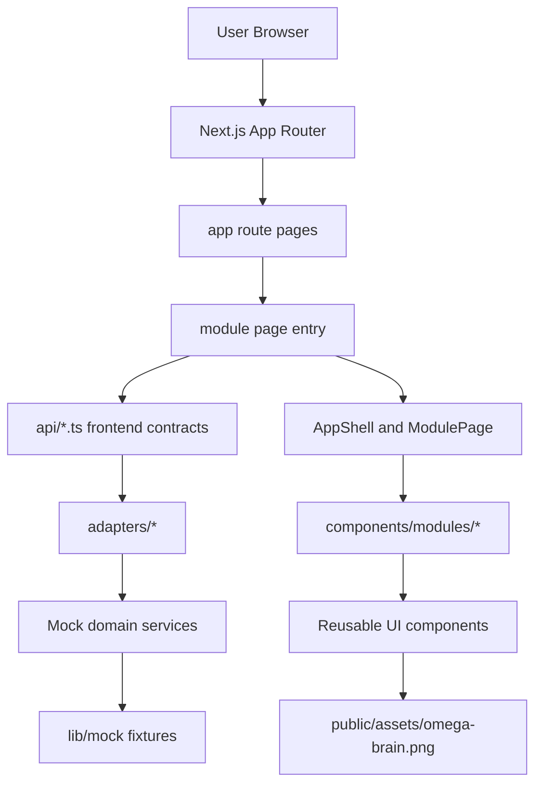
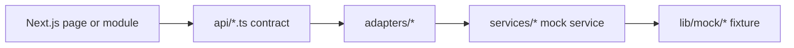
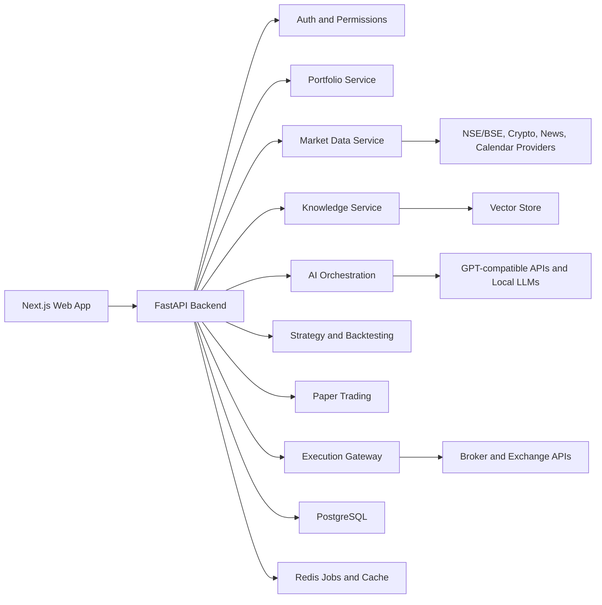
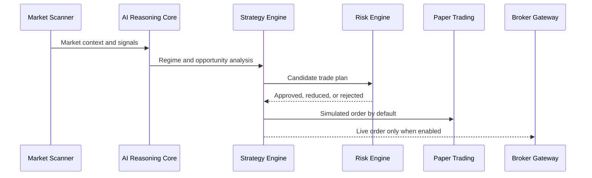
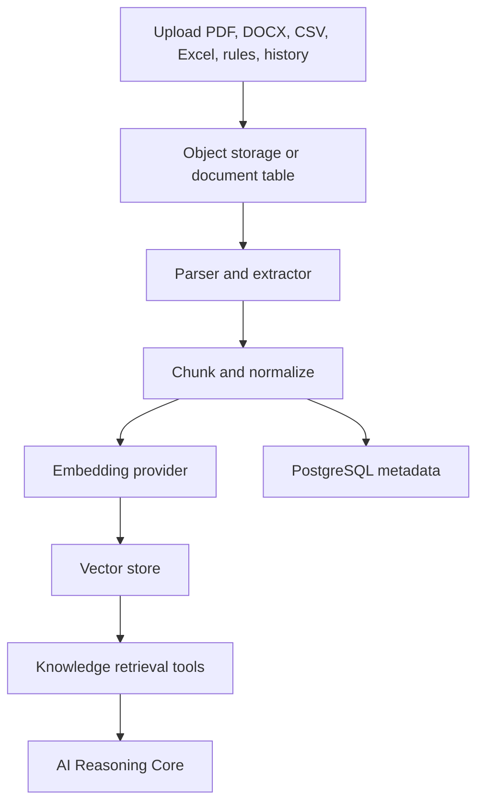
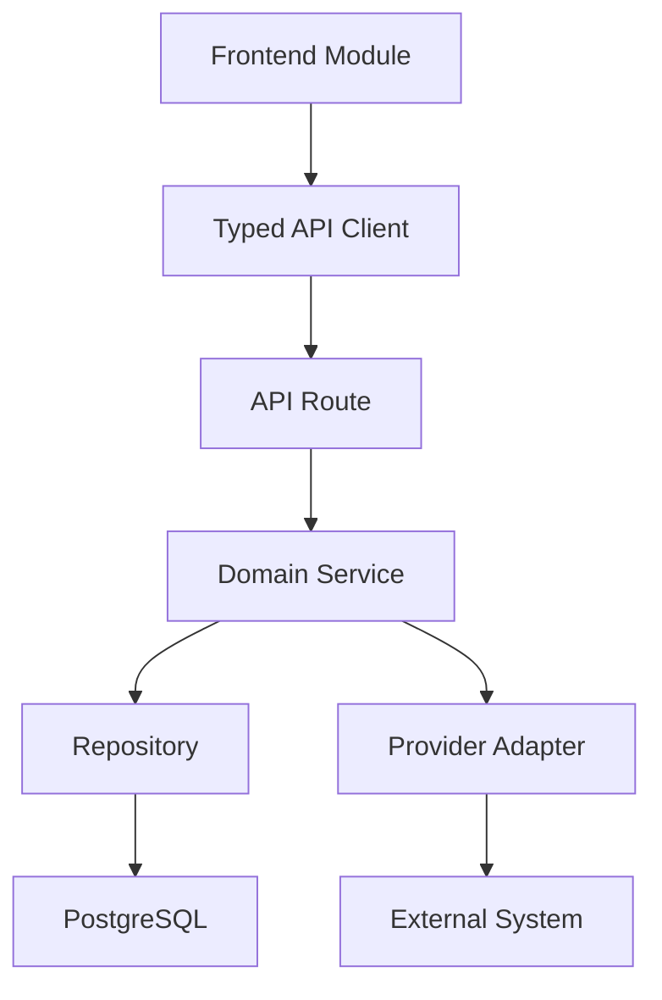

# OMEGA AI Architecture

Last updated: 2026-06-16

This document describes the current architecture and the target architecture for the OMEGA AI platform. Current implementation is a modular multi-page frontend platform backed by typed API contracts, adapter interfaces, mock services, and mock fixtures. Backend, persistence, AI, data, TradingView, and trading integrations are planned boundaries, not active runtime modules yet.

## OMEGA Core Loop

```text
Knowledge
↓
Market Intelligence
↓
AI
↓
SignalFlow
↓
Paper Trading
↓
Analytics
↓
Experience
↓
Knowledge
```

The Experience Engine closes the loop by converting paper trading outcomes into structured lessons, mock patterns, and knowledge updates. It does not train AI models and it does not create a parallel decision pipeline.

## Current Runtime Architecture



Current behavior:

- `/` requests a typed `DashboardSnapshot` through `api/system.ts`, which calls `SystemAdapter`, then the mock dashboard service.
- `/markets`, `/ai`, `/knowledge`, `/strategies`, `/backtesting`, `/paper`, `/portfolio`, `/trades`, `/analytics`, `/chat`, `/news`, `/admin`, and `/settings` render module-specific pages.
- `components/modules/` contains independently renderable modules.
- Market, portfolio, AI, strategy, news, knowledge, module, and admin fixtures live in `lib/mock/`.
- Analytics and TradingView testing placeholders also live in `lib/mock/`.
- Shared frontend models live in `lib/types/`.
- Future backend, analytics, paper trading, and TradingView testing contracts live in `lib/contracts/`.
- Frontend API contracts live in `api/` and currently delegate to adapters.
- Adapters live in `adapters/` and currently delegate to mock services.
- Feature flags live in `lib/feature-flags.ts` and are enforced by `ModulePage`.
- Mock service interfaces live in `services/` and are shaped for future provider replacement.
- File selection records file names in local component state only.
- No network calls occur.

## Phase 2 Modular Frontend

Current folders:

```text
app/
components/
  ai/
  dashboard/
  layout/
  market/
  portfolio/
  trading/
hooks/
lib/
  mock/
  types/
  utils/
services/
tests/
docs/
```

Core contracts:

- `MarketAsset`
- `TradeSignal`
- `Portfolio`
- `Position`
- `Strategy`
- `NewsEvent`
- `AIBrain`
- `KnowledgeDocument`
- `DashboardMetric`
- `ModuleDefinition`
- `SystemStatus`

Mock service interfaces:

- `MarketService`
- `PortfolioService`
- `NewsService`
- `AISystemService`
- `StrategyService`
- `KnowledgeService`

Smoke coverage:

- Dashboard render path.
- Multi-page route rendering.
- OMEGA module registry.
- Feature flags.
- Frontend API contracts.
- API adapter layer.
- Backend contract helpers.
- Data source descriptors.
- Paper trading contract models.
- TradingView testing contracts.
- System event bus.
- Mock service responses.
- Representative UI card rendering.
- Reusable layout states.
- TradingView testing placeholder.

## Phase 3 Multi-Page Frontend

Routes:

```text
/
/markets
/ai
/knowledge
/strategies
/backtesting
/paper
/portfolio
/trades
/analytics
/chat
/news
/admin
/settings
```

Every page uses shared layout primitives:

- `AppShell`
- `SharedHeader`
- `PageHeader`
- `SectionHeader`
- `StatusBadge`
- `ModuleHeader`
- `ModulePage`
- `LoadingState`
- `EmptyState`
- `ErrorState`

Independent module components:

- `DashboardModule`
- `MarketWatchModule`
- `AIBrainModule`
- `KnowledgeCenterModule`
- `StrategyLabModule`
- `BacktestingModule`
- `PaperTradingModule`
- `PortfolioModule`
- `TradeCenterModule`
- `AnalyticsModule`
- `AIChatModule`
- `NewsIntelligenceModule`
- `AdminModule`
- `SettingsModule`
- `TradingViewTestingModule`

Frontend API contract files:

- `api/market.ts`
- `api/portfolio.ts`
- `api/news.ts`
- `api/knowledge.ts`
- `api/strategy.ts`
- `api/paperTrading.ts`
- `api/analytics.ts`
- `api/ai.ts`
- `api/system.ts`
- `api/tradingViewTesting.ts`

These are not backend routes. They are replaceable frontend contracts that currently call adapter interfaces.

## Phase 4 Integration Readiness

The current data path is:



Adapters:

- `MarketAdapter`
- `PortfolioAdapter`
- `AISystemAdapter`
- `KnowledgeAdapter`
- `StrategyAdapter`
- `AnalyticsAdapter`
- `PaperTradingAdapter`
- `TradingViewTestingAdapter`
- `NewsAdapter`
- `SystemAdapter`

Contract and integration primitives:

- `lib/contracts/backend.ts` defines future request, response, error, pagination, filtering, sorting, and API versioning models.
- `lib/contracts/paper-trading.ts` defines paper accounts, orders, positions, portfolios, journals, and performance metrics.
- `lib/contracts/tradingview-testing.ts` defines testing-only chart status, signal validation, paper comparison, alert status, and historical validation contracts.
- `lib/contracts/analytics.ts` defines strategy performance, AI accuracy, market performance, paper trading performance, portfolio metrics, and historical metrics.
- `lib/data-sources.ts` registers mock, local, REST, WebSocket, broker, exchange, and TradingView source descriptors.
- `lib/result.ts` defines reusable loading, success, error, offline, and unavailable result models.
- `lib/events.ts` defines mock system events for market updates, signals, paper trades, portfolio updates, news, strategy updates, and AI state changes.

The Phase 4 layer prepares backend replacement without adding any backend runtime, secrets, live feeds, live TradingView, brokers, exchanges, or real AI providers.

## OMEGA Module Registry

The module registry lives in `lib/mock/modules.ts`. Each module declares:

- `id`
- `name`
- `description`
- `status`
- `version`
- `featureFlag`
- `icon`
- `enabled`
- `route`
- `pageRoute`
- `dependencies`
- `futureDependencies`
- `currentStatus`
- `futureBackendDependency`
- `futureAIDependency`

Registered modules:

- Dashboard
- Market Watch
- AI Brain
- Knowledge Center
- Strategy Lab
- Backtesting
- Paper Trading
- Portfolio
- Trade Center
- Analytics
- AI Chat
- News Intelligence
- Admin
- Settings

## Feature Flags

Frontend flags live in `lib/feature-flags.ts`:

- `ENABLE_MARKETS`
- `ENABLE_AI`
- `ENABLE_KNOWLEDGE`
- `ENABLE_STRATEGIES`
- `ENABLE_BACKTEST`
- `ENABLE_PAPER`
- `ENABLE_PORTFOLIO`
- `ENABLE_TRADES`
- `ENABLE_ANALYTICS`
- `ENABLE_CHAT`
- `ENABLE_NEWS`
- `ENABLE_ADMIN`
- `ENABLE_SETTINGS`

All are enabled for the current mock frontend. `ModulePage` checks the registry flag before rendering module content.

## TradingView Testing Preparation

TradingView is not integrated. The frontend only has mock interfaces for future testing workflows:

- TradingView status
- Testing status
- Paper trading validation
- Signal comparison
- AI accuracy tracking

The placeholder data lives in `lib/mock/tradingview-testing.ts` and renders through `TradingViewTestingModule`.

## Analytics Placeholders

Analytics are mock-only and include:

- AI Accuracy
- Strategy Accuracy
- Market Performance
- Paper Trading Results
- Signal Statistics
- Portfolio Statistics
- Historical Metrics

## Target System Architecture



Design principles:

- Keep providers replaceable.
- Keep live execution permission-gated.
- Store every AI decision, market snapshot, signal, and order action with audit context.
- Let paper trading mature before broker order execution.
- Prefer mock providers first, then real adapters.

## Frontend

Current:

- `app/layout.tsx` defines metadata and imports global styles.
- `app/page.tsx` loads the dashboard snapshot through `systemApi` and renders the dashboard overview.
- `app/*/page.tsx` renders module-specific pages.
- `app/globals.css` defines global browser and focus behavior.
- Tailwind tokens live in `tailwind.config.ts`.

Current frontend structure:

```text
app/
  page.tsx
  */page.tsx
api/
adapters/
components/
  layout/
  dashboard/
  market/
  modules/
  ai/
  trading/
  portfolio/
lib/
  contracts/
  mock/
  types/
  utils/
  data-sources.ts
  events.ts
  feature-flags.ts
  result.ts
hooks/
services/
tests/
```

Core UI modules:

- Dashboard
- Market Watch
- AI Brain
- Knowledge Center
- Strategy Lab
- Backtesting
- Paper Trading
- Portfolio
- Trade Center
- News Intelligence
- Learning Engine
- Analytics
- AI Chat
- Admin Panel
- Settings

## Backend

Current:

- No backend exists.

Target backend:

- Python FastAPI application
- Versioned API routes under `/api/v1`
- Pydantic schemas for external contracts
- Repository/service separation for database-backed modules
- Worker queue for ingestion, backtests, scanners, and learning jobs
- Permission middleware for trading and admin actions

Suggested backend folders:

```text
backend/
  app/
    main.py
    api/
      v1/
    core/
      config.py
      security.py
    models/
    schemas/
    services/
    providers/
    workers/
    migrations/
```

## Database

Current:

- No database files or connection code.

Target database:

- PostgreSQL for transactional state and auditability.
- Redis for caching, queues, locks, and transient scanner state.
- Vector store for knowledge retrieval.

Core entity groups:

- Identity: users, roles, sessions, permissions
- Market data: instruments, candles, quotes, events
- Portfolio: accounts, holdings, positions, cash, snapshots
- Trading: orders, fills, signals, risk checks
- Paper trading: simulated accounts, trades, journal entries, equity curves
- Strategy: strategies, parameters, backtest runs, trade histories
- Knowledge: documents, chunks, embeddings, ingestion runs
- AI: runs, prompts, outputs, model metadata, explanations
- Admin: audit logs, secrets metadata, system settings

## API Routes

Current:

- No API routes exist.

Target route map:

```text
GET    /api/v1/health
GET    /api/v1/status
GET    /api/v1/modules

GET    /api/v1/markets/watchlist
GET    /api/v1/markets/quotes
GET    /api/v1/markets/candles
POST   /api/v1/markets/scan

GET    /api/v1/portfolio/summary
GET    /api/v1/portfolio/positions
GET    /api/v1/portfolio/equity-curve

POST   /api/v1/knowledge/documents
GET    /api/v1/knowledge/documents
POST   /api/v1/knowledge/search

POST   /api/v1/ai/analyze-market
POST   /api/v1/ai/chat
GET    /api/v1/ai/runs

GET    /api/v1/strategies
POST   /api/v1/strategies
POST   /api/v1/backtests
GET    /api/v1/backtests/{id}

GET    /api/v1/paper/accounts
POST   /api/v1/paper/orders
GET    /api/v1/paper/trades

GET    /api/v1/admin/settings
PATCH  /api/v1/admin/settings
GET    /api/v1/admin/audit-logs
```

## Authentication And Permissions

Current:

- No authentication is implemented.
- Live trading is locked in the UI.

Target permission model:

- Read-only user: dashboard, market data, analytics
- Research user: knowledge upload, AI chat, backtests
- Paper trader: paper order creation and journal updates
- Admin: provider configuration, API key metadata, risk rules
- Live trader: broker action permissions after explicit enablement

Permission gates:

- Live order placement disabled by default.
- Broker credentials stored outside source control.
- Risk checks required before any order leaves the system.
- Emergency flatten requires explicit role and audit confirmation.

## Trading Modules

Current:

- Trading modules are UI-only simulations.

Target module flow:



Target services:

- Signal service
- Strategy service
- Backtest service
- Risk service
- Order service
- Paper broker service
- Live broker adapters

## AI Modules

Current:

- Static text represents AI reasoning and confidence.

Target AI architecture:

- Provider interface for remote and local models
- Tool layer for market, portfolio, knowledge, and strategy context
- Prompt and policy registry
- Run logging with inputs, outputs, model, tools, and risk flags
- Retrieval-augmented knowledge search
- Evaluation harness for strategy and recommendation quality

Provider contract:

```text
AIProvider
  analyzeMarket(context) -> MarketAnalysis
  generateStrategy(requirements) -> StrategyDraft
  reviewPortfolio(portfolio, marketContext) -> PortfolioReview
  chat(messages, tools) -> AssistantMessage
```

Do not hardcode one model provider into business modules.

## Knowledge System

Current:

- File input captures selected file names only.

Target ingestion flow:



## Market Data System

Current:

- Static market rows.

Target abstractions:

- Instrument registry
- Quote provider
- Candle provider
- Corporate action provider
- News provider
- Economic calendar provider
- Provider health and freshness checks

Markets to support:

- Indian equities
- Indian F&O
- Indian commodities
- Crypto spot
- Crypto futures
- Forex
- Global indices
- ETFs

## Portfolio System

Current:

- Static dashboard metrics.

Target capabilities:

- Accounts
- Cash balances
- Holdings
- Open positions
- Realized and unrealized PnL
- Exposure and allocation
- Margin and leverage
- Equity curve
- Risk limits and breach logs

## Paper Trading

Current:

- Static trade rows and chart sample.

Target flow:

- Start with isolated paper accounts.
- Accept validated signal/order requests.
- Simulate fills with configurable slippage and fees.
- Record trades, orders, fills, snapshots, and journal notes.
- Feed results back into strategy and learning modules.

## Live Trading

Current:

- Locked UI only.

Target guardrails:

- Broker adapters remain disabled until credentials and explicit permissions exist.
- Live mode requires configured risk rules.
- Every order passes pre-trade validation.
- Every external order action is auditable.
- Paper mode remains the default execution path.

## Admin Panel

Current:

- Static broker, risk, and log panels.

Target capabilities:

- Manage API key metadata without exposing secrets
- Configure provider adapters
- Enable or disable modules
- Set risk limits
- View audit logs
- Review AI and order actions
- Manage knowledge base ingestion

## Module Communication

Recommended pattern:

- Frontend modules request data through typed API clients.
- API routes call backend services.
- Services use provider interfaces for external systems.
- Services persist authoritative state in PostgreSQL.
- Long-running work is queued through Redis-backed workers.
- AI decisions consume snapshots, not unstable live objects.



## Stability Rules For Future Work

- Keep the working dashboard available while modules are extracted.
- Add one backend capability at a time with mock providers first.
- Avoid live trading until auth, risk, audit, and paper execution are stable.
- Use typed contracts between frontend, backend, AI, and providers.
- Document every major provider and trading permission decision.
