# Phase 10 - Market Intelligence Layer

Phase 10 adds structured market awareness to OMEGA without live market feeds, broker APIs, exchange APIs, or real financial transactions.

## Architecture

Market Intelligence reuses the existing market snapshot flow:

```mermaid
flowchart LR
  MarketSnapshot[lib/mock/market.ts] --> MarketService[services/market-service.ts]
  MarketService --> MarketAdapter[adapters/market-adapter.ts]
  MarketAdapter --> MarketApi[api/market.ts]
  MarketApi --> MarketIntel[Mock Market Intelligence]
  MarketIntel --> SignalFlow[Existing SignalFlow]
  SignalFlow --> PaperTrading[Paper Trading]
  PaperTrading --> Analytics[Analytics]
```

## Rules Preserved

- Mock-first architecture.
- Provider independence.
- TradingView remains optional.
- No live feeds.
- No broker or exchange integrations.
- No parallel market pipeline.
- Market Intelligence is an input to SignalFlow, not an execution path.

## Mock Sources

- Economic events.
- Sector trends.
- Market news context.
- Volatility context.
- Trading sessions.
- TradingView observations.
- Paper trading results.

## SignalFlow Integration

`lib/market-intelligence-integration.ts` exposes helpers that prepare and apply market context to existing `TradeSignal` objects. The helpers enrich reasoning and confidence context only; they do not make independent execution decisions.
